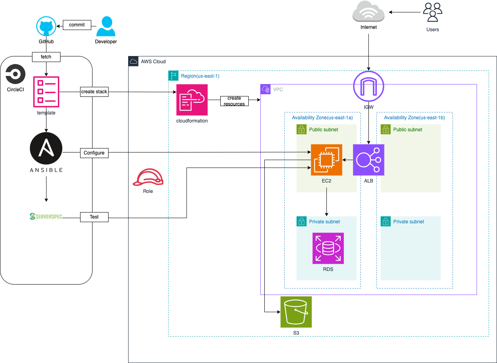

# インフラ構築自動化プロジェクト
## 概要 
CircleCIでAWSリソースを作成し,EC2インスタンスでAnsibleを実行し,Serverspecを使用してEC2インスタンスをテストしてRailsのWebアプリを自動で構築しました。
## インフラ自動構築の流れ
1. **開発者**: 開発者がコードを記述し、それをGitHubにコミットします。
2. **GitHub**: コミットされたコードがリポジトリにプッシュされます。
3. **CircleCI構成ファイル**: リポジトリには、CI/CDパイプライン構成を指定する`.circleci/config.yml`ファイルが含まれています。
4. **CircleCIワークフロー実行**: CircleCIは新しいコミットを検出し、構成ファイルで定義されたワークフローをトリガーします。
5. **ジョブ**: ワークフローはいくつかのジョブで構成されます:
- **AWSリソースの作成**: Cloudformationを使用して、EC2インスタンスやその他の必要なAWSリソースを作成します。
- **Ansibleプレイブックの実行**: EC2インスタンスが起動したら、Ansibleを使用してインスタンスを構成します。
- **Serverspecテストの実行**: Serverspecは、EC2インスタンスが正しく構成されていることを確認するために、EC2インスタンスでテストを実行するために使用されます。
## 構成図
