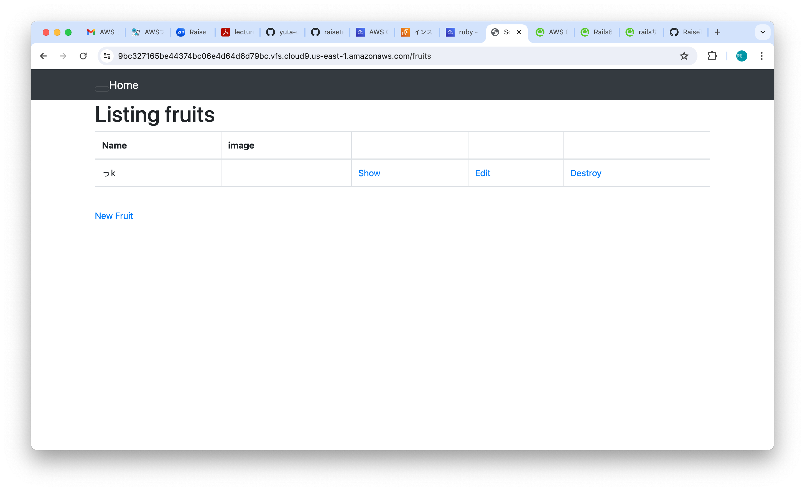
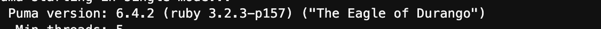
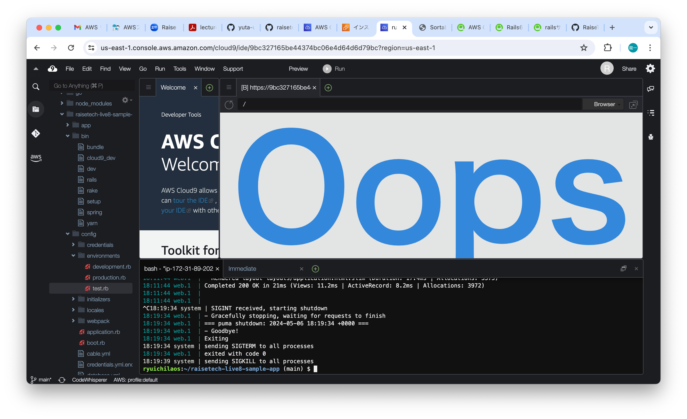
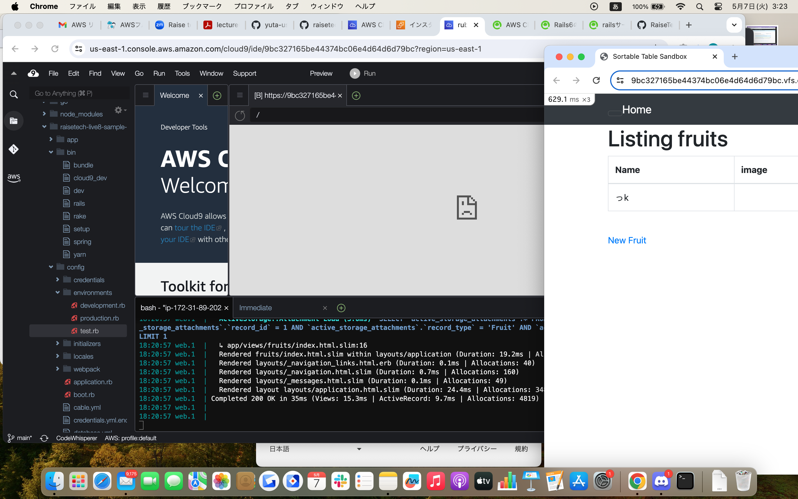
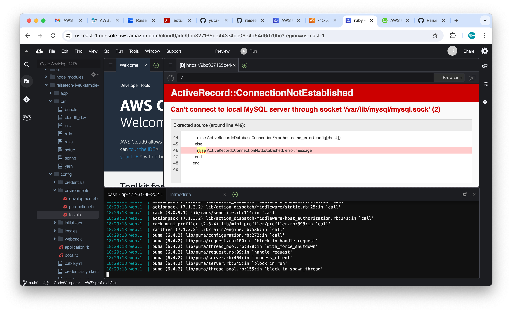

# 第３回課題
- サンプルアプリケーション起動
  
1. AP サーバー
    - 名前とバージョン：Puma version: 6.4.2 (ruby 3.2.3-p157) ("The Eagle of Durango")
    
    - APサーバを終了させた場合、引き続きアクセスできなくなる
    
    - またAPサーバを起動
    
2. DB サーバー
    - 名前とバージョン：mysql  Ver 8.4.0
    
    - DBサーバを終了させた場合、引き続きアクセスできなくなる
    
    - Railsの構成管理ツール：Bundler
- 今回の課題から学んだこと、感じたこと  
   無料枠のインスタンスサイズだと起動できなかったです。デプロイする前にサーバのスペックを考慮する必要があると思いました。