# 第5回課題
- EC2 上にサンプルアプリケーションをデプロイ
  - 組み込みサーバ
    - セキュリティグループ
     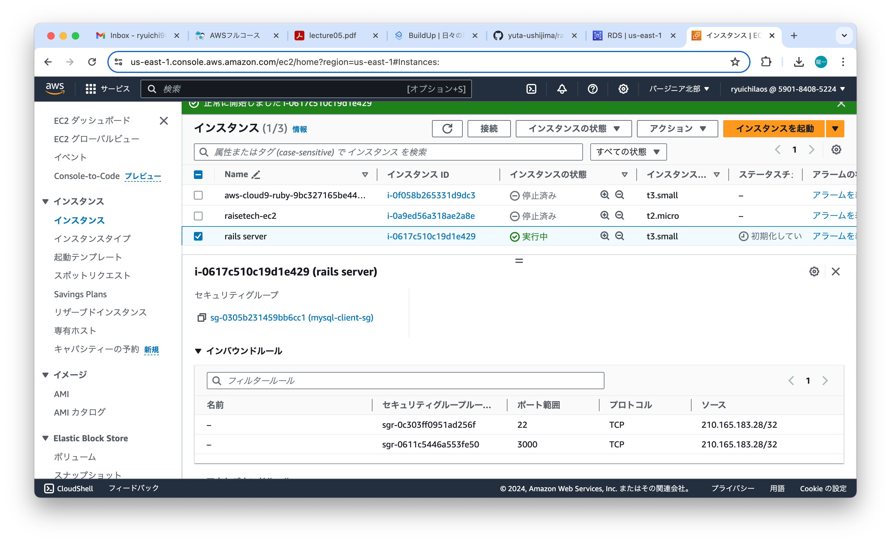
    - 動作確認
     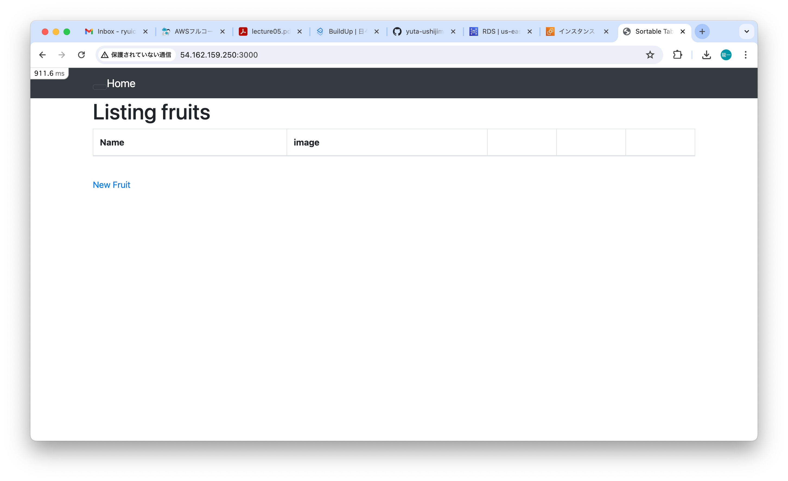
  - curl確認
   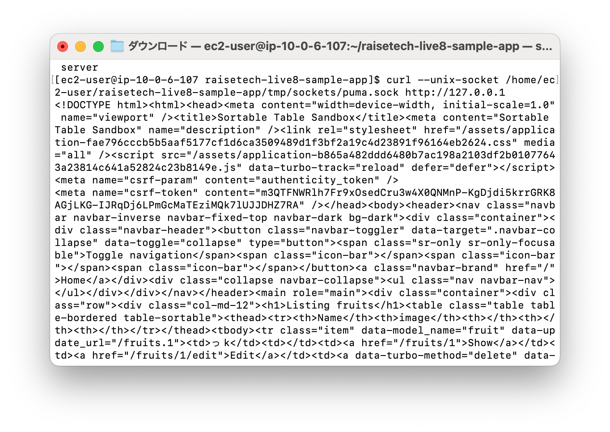
  - アプリケーションサーバ
    - セキュリティグループ
     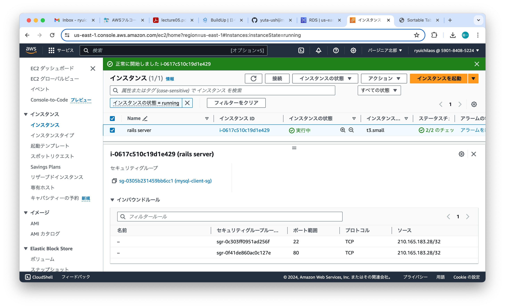
    - 動作確認
     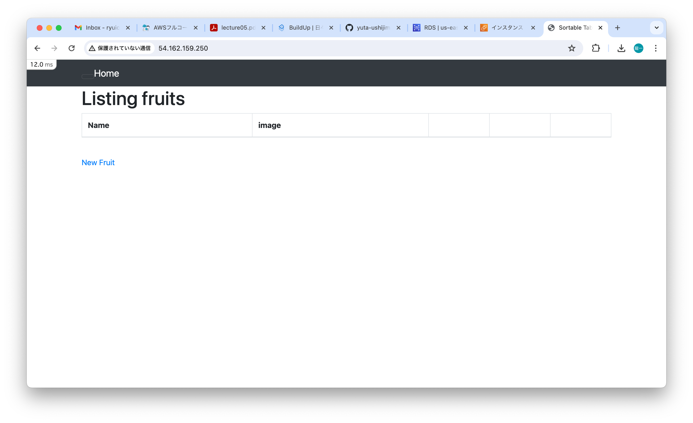
- ELB追加
  - セキュリティグループ
    - ELB
      - インバウンド
       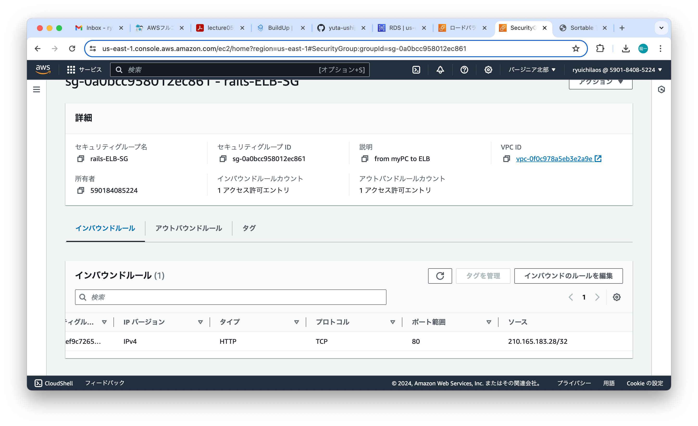
      - アウトバウンド
      　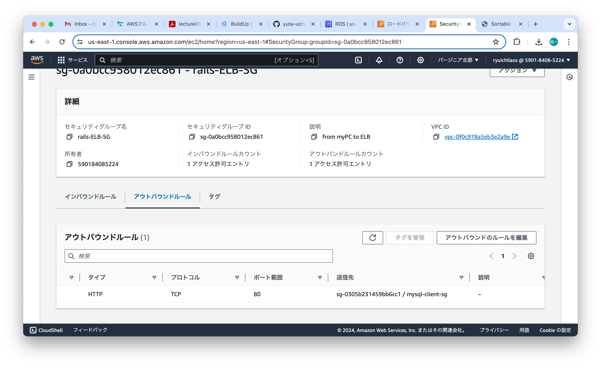
    - EC2
     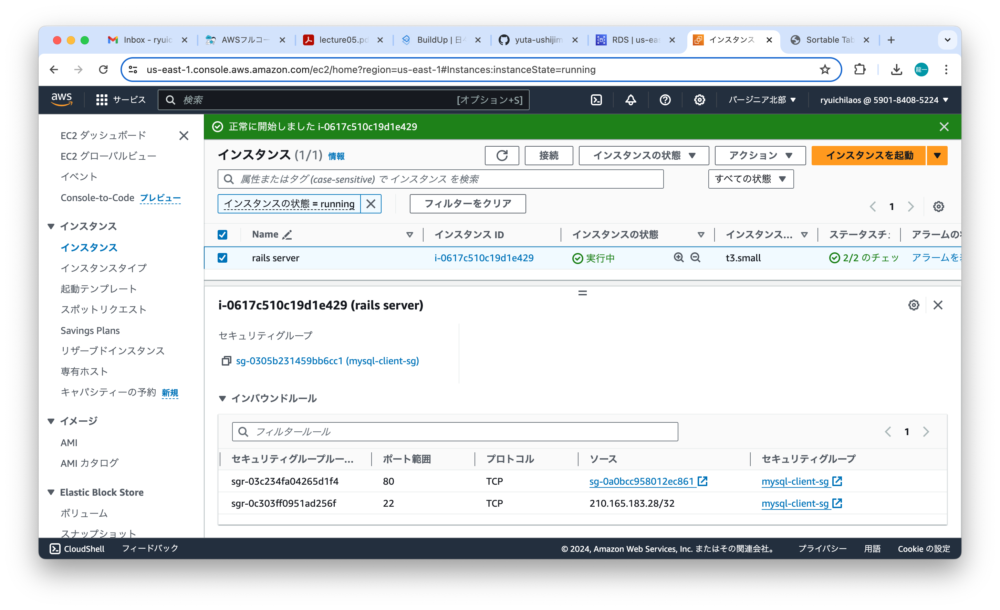
  - 動作確認
   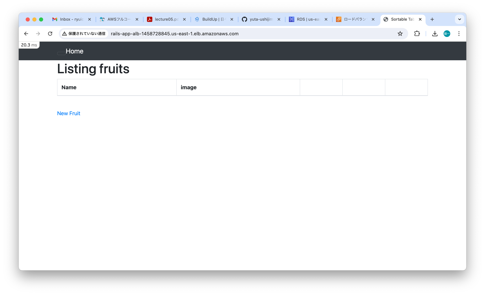
- アプリの画像保存先として、S3追加
  - アプリに画像保存確認
   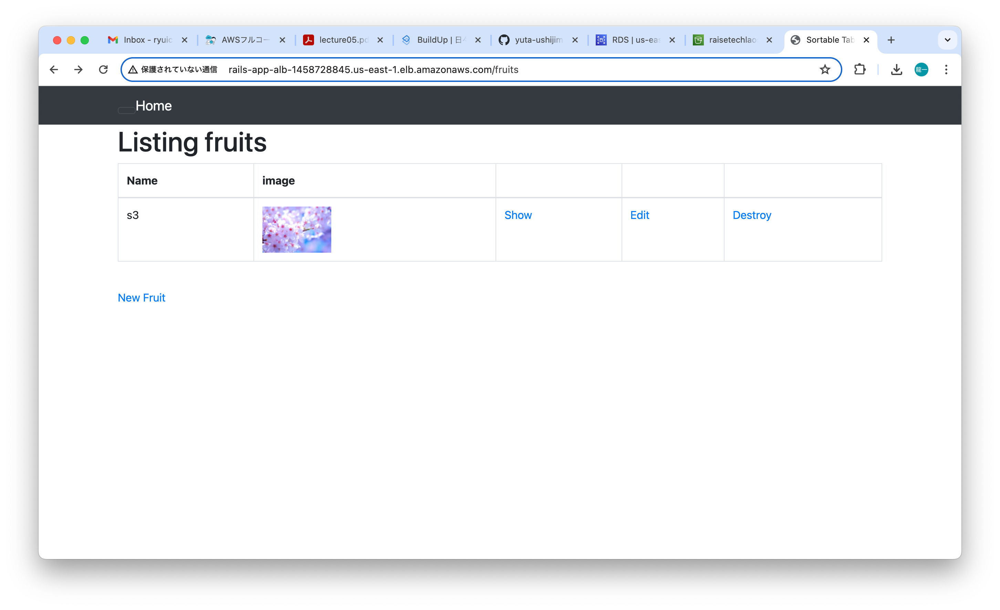
  - s3に画像が保存されていることを確認
   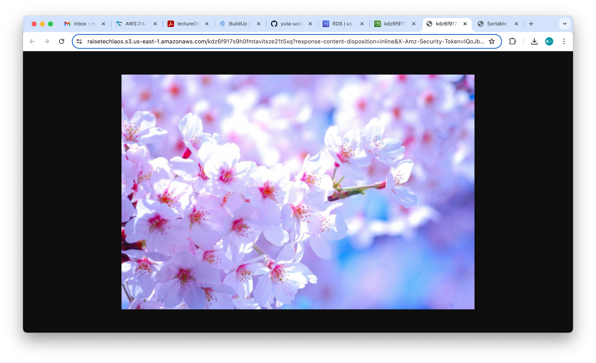
- aws構成図  
 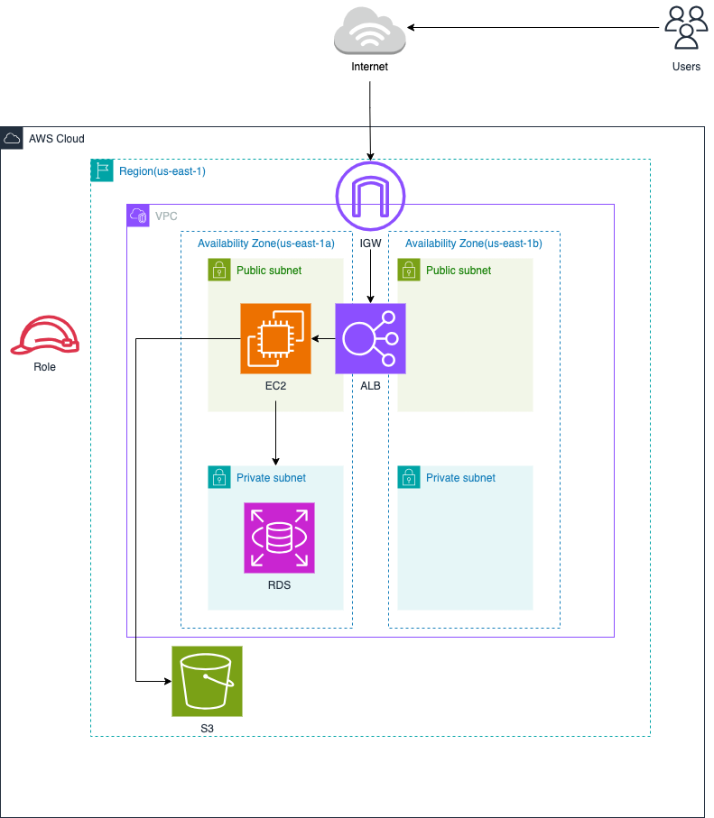
