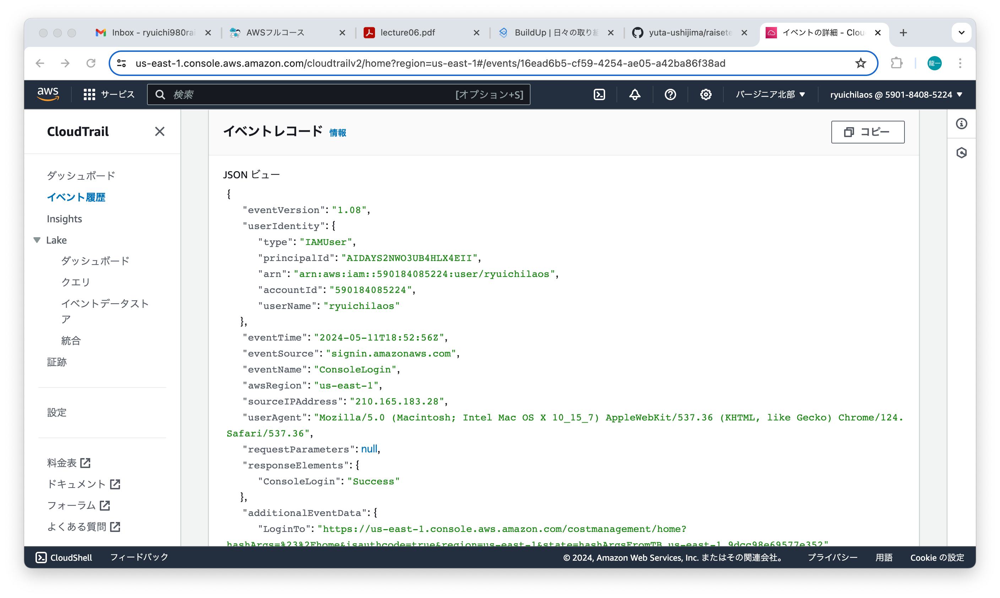
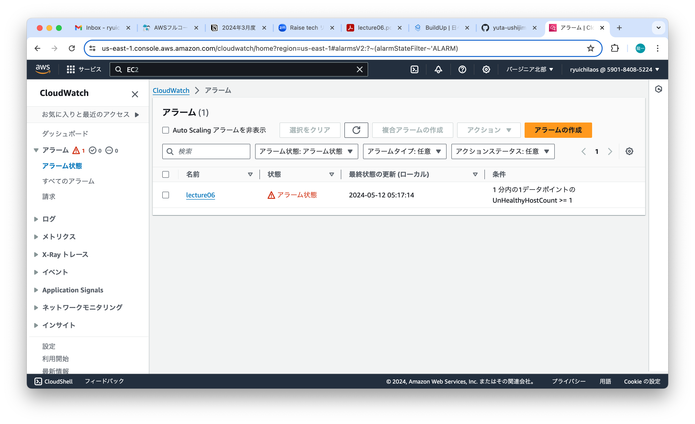
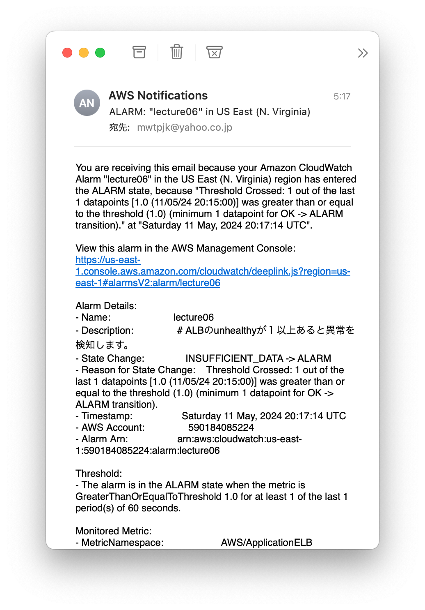
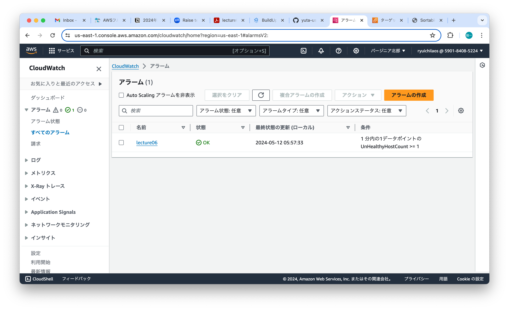
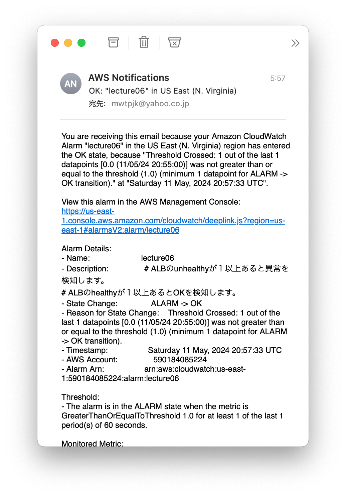
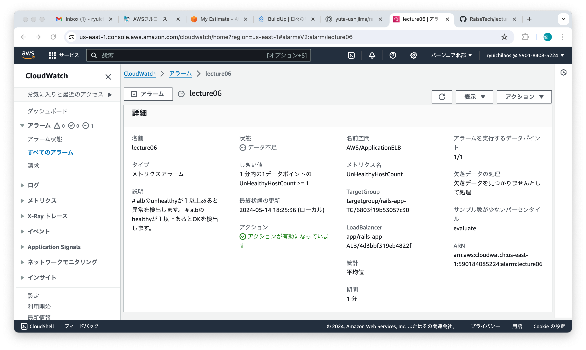
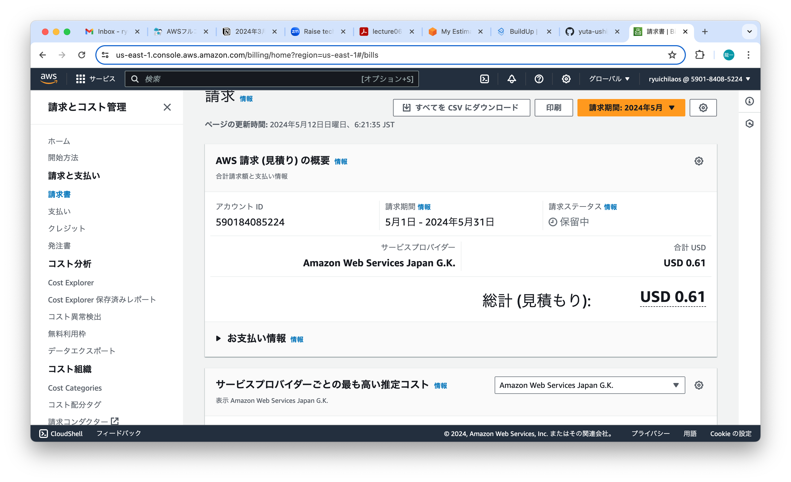
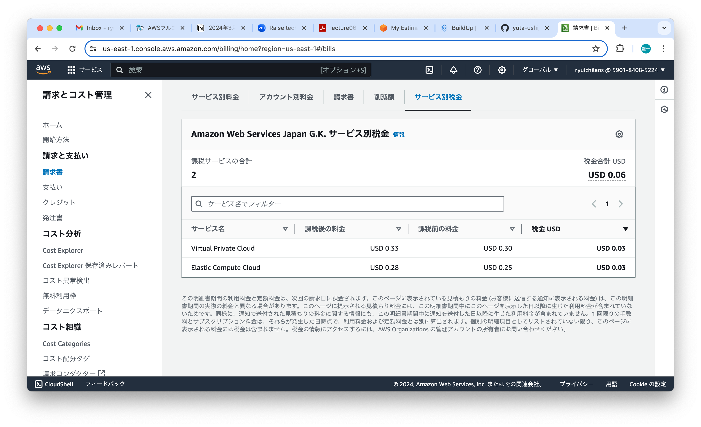

# 第6回課題
## CloudTrail のConsoleLoginイベントの中に含まれている情報
  1. ログインしたリージョン
  2. ログインした時間
  3. ログイン元のIPアドレス
  
## CloudWatch アラームを使って、ALB のhealthyが１つ以上あるかどうかのアラームを設定
### EC2を停止するとアラーム状態になります
 
 
### EC2を起動するとOK状態になります
 
 
### アラーム詳細の設定
 
## 今日までに作成したリソースの内容を見積り
https://calculator.aws/#/estimate?id=0f225808127d31b06aeef21c0e804bdfa2605cf5
## マネジメントコンソールから、現在の利用料を確認

### EC2の料金は$0.28です。無料枠のインスタンスは使わなかったため、無料ではありません。
  
