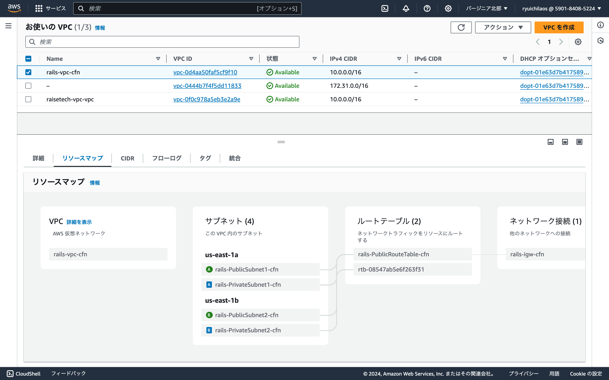
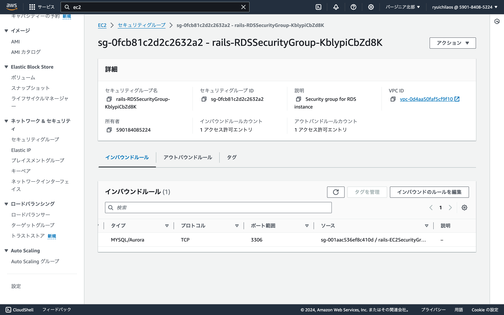
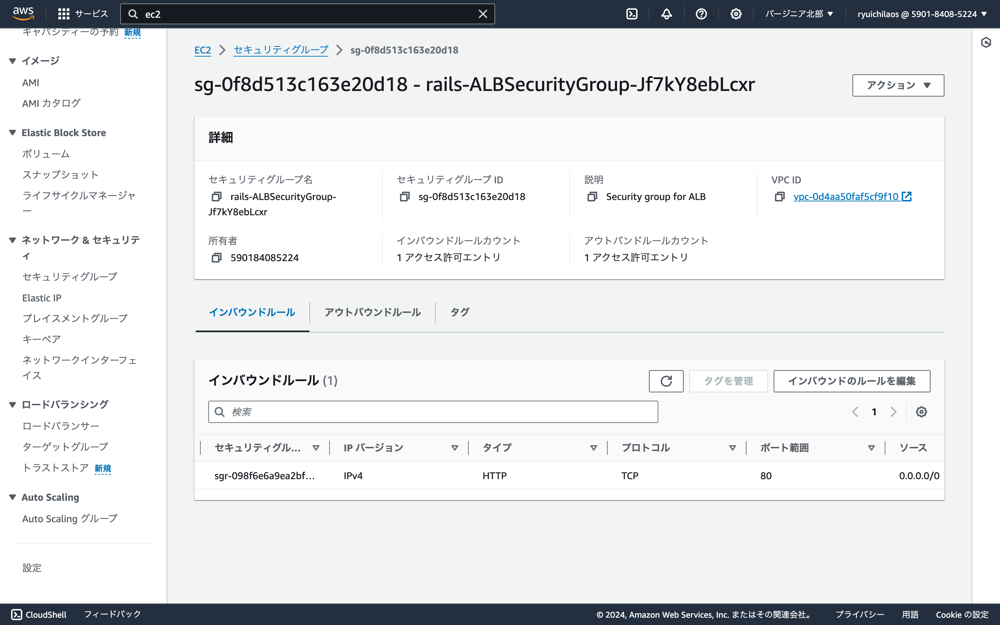
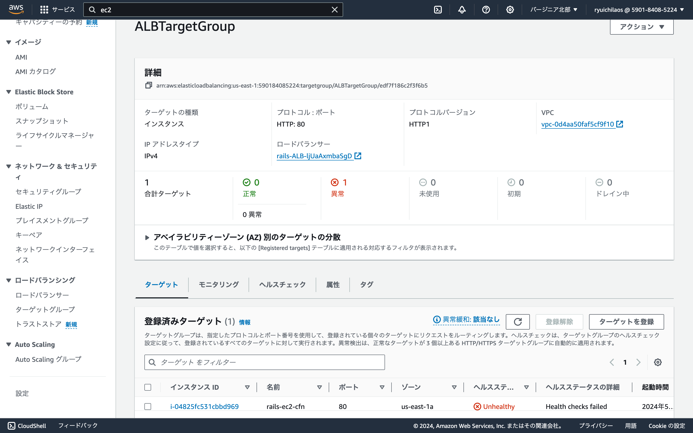
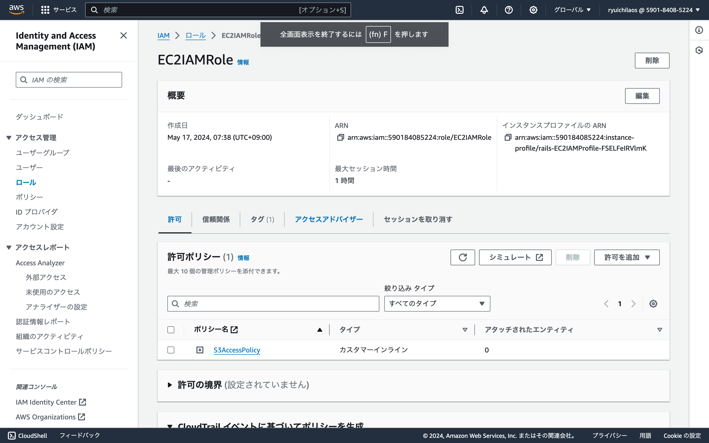
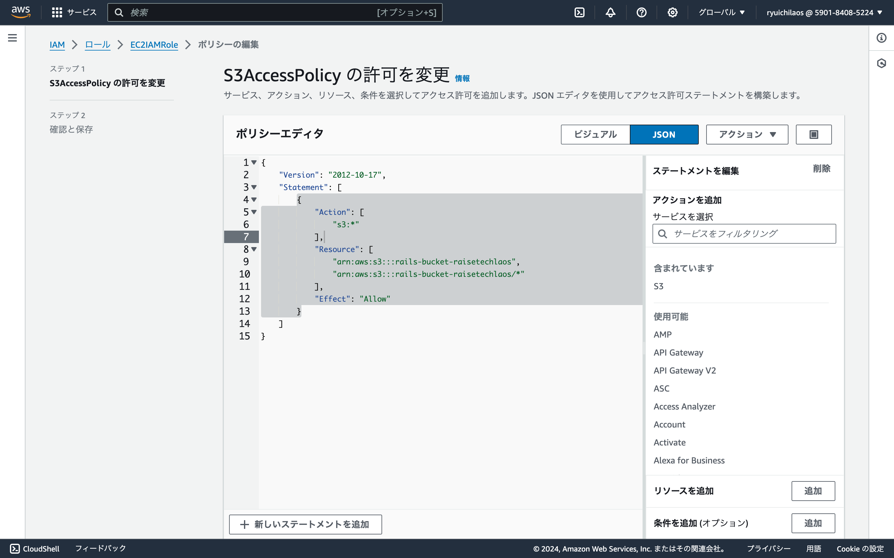

# 10回目の課題、cloudformationで作成したリソースの証跡
## 作成したスタック

## vpc

## セキュリティグループ
  - ec2

  - rds

  - alb

## ec2

## rds

## ec2からrdsへログイン

## alb

### albのリスナー

### ターゲットグループ

## ec2からs3へアクセスするロール

### 上記ロールにアタッチされたポリシー
