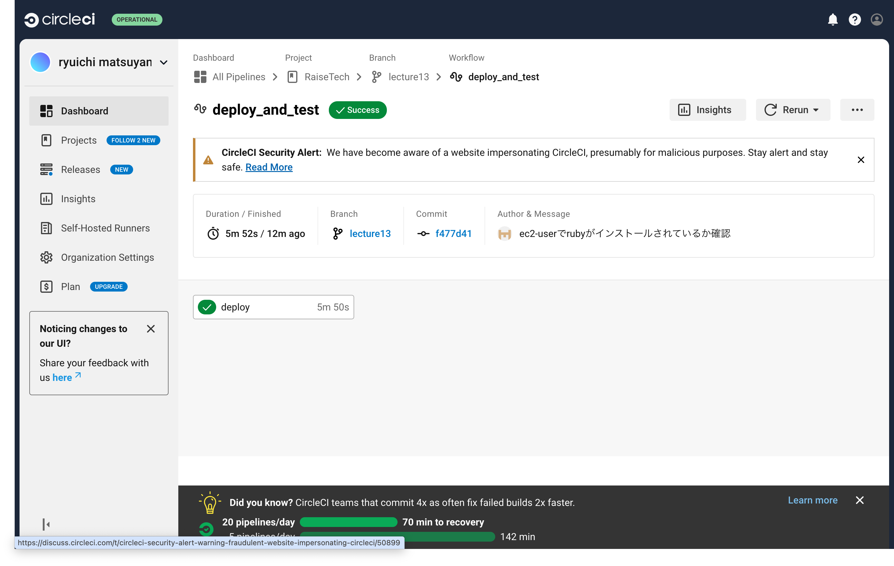
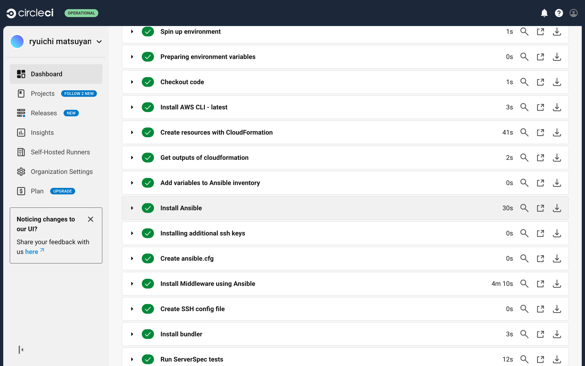

# 13回目の課題、 CircleCI のサンプルに ServerSpec や Ansible の処理を追加する。
## CircleCIのコンソールで設定する環境変数
  1. AWS_ACCESS_KEY_ID
  2. AWS_DEFAULT_REGION
  3. AWS_SECRET_ACCESS_KEY
  4. MasterUserPassword(rdsのパスワード)
  5. stackName(cloudformationのスタック名)
## CircleCI実行結果
- deployというジョブが成功しています。
  
  
## アプリケーションの動作確認
- 動作できています。
  
